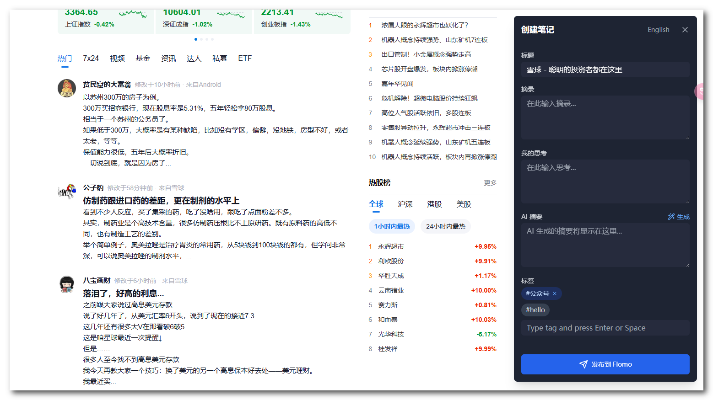

# Flomo Stream

一个帮助你快速收集网页内容并通过 AI 总结发送到 Flomo 的浏览器扩展。



## 🌟 特性

- 🎯 一键收藏网页内容到 Flomo
- 🤖 AI 驱动的文章摘要生成
- ✂️ 智能文本选择和摘录
- 🏷️ 灵活的标签管理
- 💫 优雅的浮动球交互
- 🌐 支持中英文界面

## 🛠️ 技术栈

- **框架**: React + TypeScript
- **状态管理**: Zustand
- **样式**: Tailwind CSS
- **API 集成**:
  - OpenAI API (文章摘要)
  - Flomo API (笔记同步)

## 📦 安装

1. 克隆仓库：

```bash
git clone [repository-url]
cd flomo-stream
```

2. 安装依赖：

```bash
pnpm install
```

3. 构建扩展：

```bash
pnpm run build
```

4. 在 Chrome 中加载扩展：
   - 打开 Chrome 扩展管理页面 (`chrome://extensions/`)
   - 启用"开发者模式"
   - 点击"加载已解压的扩展程序"
   - 选择项目的 `dist` 目录

## ⚙️ 配置

首次使用需要配置以下内容：

1. **Flomo 配置**

   - Flomo User ID
   - Flomo API Key

2. **OpenAI 配置** (可选，用于 AI 摘要)
   - API Key
   - API Base URL (可选)
   - 模型选择
   - 提示词定制

## 🎯 使用方法

1. **收藏网页内容**

   - 点击浮动球打开编辑器
   - 自动获取页面标题和 URL
   - 选择文本自动添加到摘录

2. **AI 摘要**

   - 点击 AI 摘要按钮
   - 等待生成摘要
   - 可以编辑生成的摘要

3. **标签管理**

   - 使用预设标签
   - 添加自定义标签
   - 快速筛选标签

4. **发送到 Flomo**
   - 编辑完成后点击发送
   - 支持预览最终内容
   - 发送成功后显示提示

## 🏗️ 项目结构

```
src/
├── background/        # 后台服务脚本
├── components/        # React 组件
├── content/          # 内容脚本
├── services/         # API 服务
├── store/            # 状态管理
├── types/            # TypeScript 类型定义
└── utils/            # 工具函数
```

### 核心文件说明

- `manifest.json`: 扩展配置文件
- `background/index.ts`: 后台服务脚本，处理页面信息收集
- `content/index.tsx`: 内容脚本，处理页面交互
- `store/index.ts`: 全局状态管理
- `components/`: UI 组件目录
  - `FloatingBall.tsx`: 浮动球组件
  - `NoteEditor.tsx`: 笔记编辑器组件

## 🔄 工作流程

1. 后台脚本监听页面加载
2. 内容脚本注入交互组件
3. 用户通过浮动球触发操作
4. 编辑器处理用户输入
5. 调用 API 服务处理数据
6. 将内容同步到 Flomo

## 📝 开源协议

[MIT License](LICENSE)
